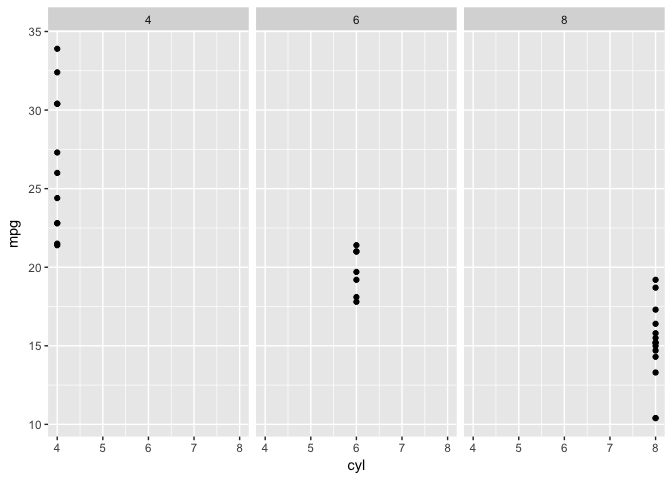

Task 5- Making R Markdown with Mtcars
=====================================

Load necessary packages

    library(ggplot2)

Analyze Data
------------

Find the median Voltage by calculating median and then printing it to
show on screen

    med<- median(mtcars$cyl)
    print(med)

    ## [1] 6

PLot some of the data to determine if there is a relationship between cyl and mpg
---------------------------------------------------------------------------------

    knitr::opts_chunk$set(fig.path = "plots/")
    cyl_mpg<-ggplot(mtcars, aes(x =cyl, y = mpg))+
      geom_point()+
      facet_wrap(~cyl)
    print(cyl_mpg)

results/discussion
------------------

This data anlysis showed that the median cyl for all of the cars was 6.
It also shows that the more cyl a car has the lower the mpg is.
